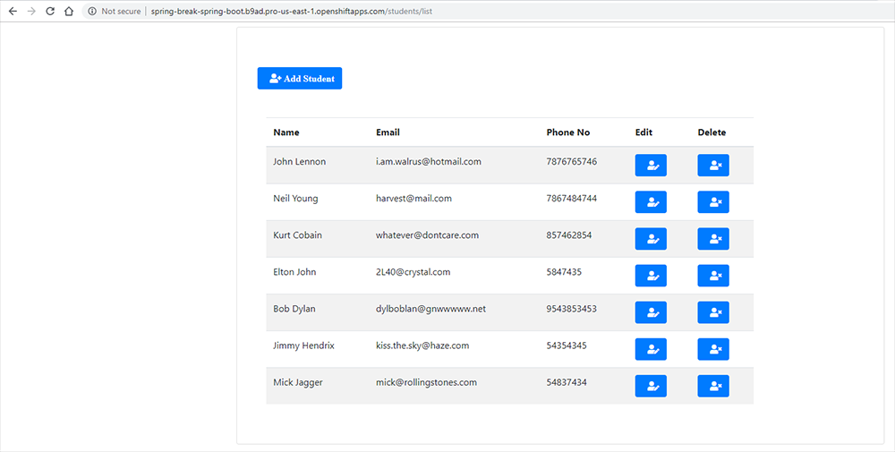

# Spring Break
A Spring Boot CRUD app which maintains a list of students with their contact details. Based on the example at https://www.javaguides.net/2019/04/spring-boot-thymeleaf-crud-example-tutorial.html
 
 
Live version deployed on OpenShift at http://spring-break-spring-boot.b9ad.pro-us-east-1.openshiftapps.com/
 
 
 

 
 
##Start-up script
1. `sh startup.sh`
2. Open browser at http://localhost:8080

##Maven start-up
1. `./mvnw spring-boot:run`
2. Open browser at http://localhost:8080
